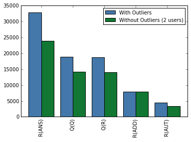
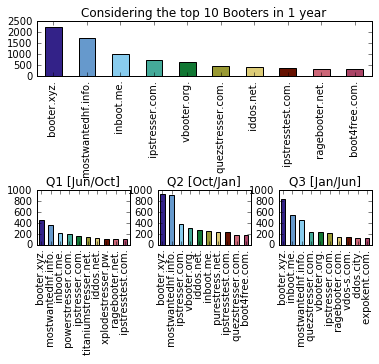
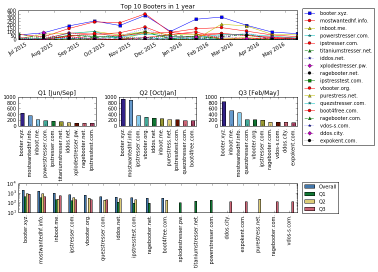
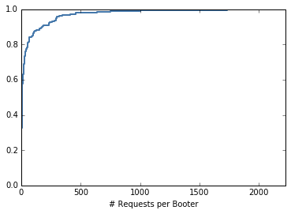
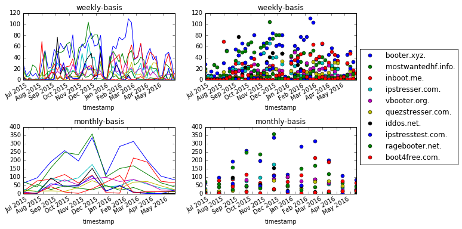
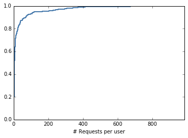
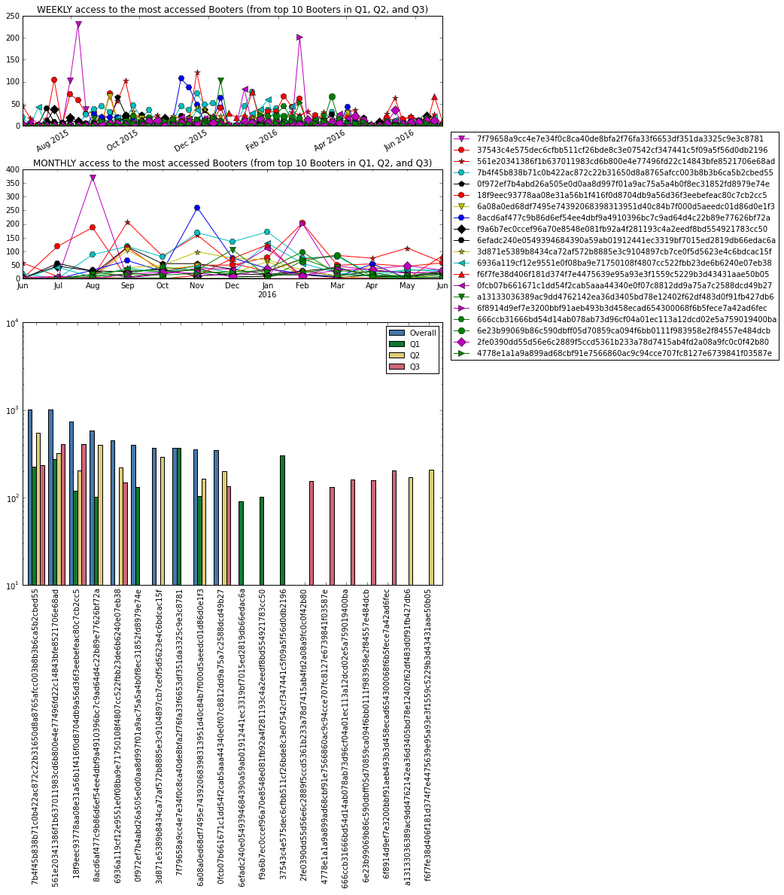
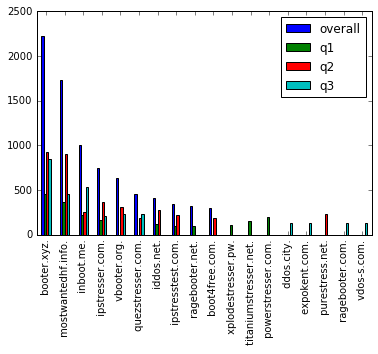
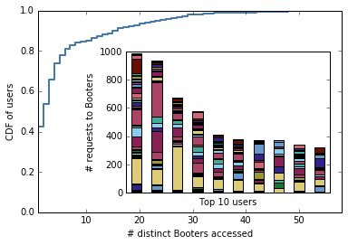
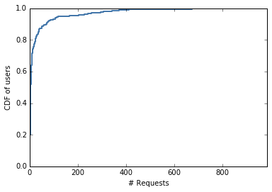

# booterblacklist_surfnet_case
Analysis of the (anonymised) data collected by the Dutch NREN (SURFnet) based on the booterblacklist.com


<center> <h2>Booter-Access-Monitoring in the Dutch NREN</h2> 
</center><center> <h3>1 year of data to support the usage of Booter blacklist</h3> </center>


- About: this ipython notebook (jupyter) describes all the analysis performed using one year of data provided by SURFnet.

- Data: each record is either a DNS request or part of the DNS response related to a Booter blacklist provided to SURFnet.

<br>
<div id="TOC"><ul>
<li><a href="#preamble">Part I: Preamble & pre-analysis</a></li>
    <ul>
    <li><a href="#rq1">RQ: How many different record types are in the data set? and excluding the outlier client?</a></li>
    </ul>

<li><a href="#analysis">Part II: The analysis</a></li>
    <ul>
        <li><a href="#booters">Booters</a></li>
            <ul>
                <li><a href="#rq3">RQ: What are the top10 most accessed Booters?</a></li>
                <li><a href="#rq4">RQ: What is the cumulative distribution of requests per Booter? and exluding the top10?</a></li>
                <li><a href="#rq5">RQ: What is the timeseries of the requests for Booters per week? and per month?</a></li>
               
        </ul>
        
        <li><a href="#users">Users</a></li>
            <ul>
            <li><a href="#rq2">RQ: What is the cumulative distribution of the requests per users?</a></li>
            </ul>
    </ul>
    
    
</ul>
</div>


<div id="preamble">
<h1><a href="#TOC">Part I: Preamble & Pre-analysis</a></h1>
</div>


## A. Importing libraries


```python
import numpy as np
import pandas as pd
import matplotlib.pyplot as plt
#plt.style.use('ggplot')
%matplotlib inline

import matplotlib.patches as mpatches


from mpl_toolkits.axes_grid.inset_locator import inset_axes


import itertools
from itertools import cycle, islice
```

## B. Loading the dataset  
(in pandas a dataset is loaded as "data frame" for this reason we use the acronym "df")

(and skipping lines that have more columns than expected)


```python
df0 = pd.read_csv('../data/20160530_surfnet_booters.txt', error_bad_lines=False, sep=',',\
                  names = ['timestamp', 'recordtype', 'client', 'in','querytype','value'])
```

## C. Normalizing the data
- Converting the collumn 'reqres' to lower case and remove 'www'
- Converting epoch timestamp into date.


```python
df0['value'] = map(lambda x: x.lower().replace('www.','',-1), df0['value'])
df0['timestamp'] = pd.to_datetime(df0['timestamp'],unit='s')
```

## D. Investigating outlier(s)


```python
df0[df0['recordtype']==' Q(Q)']['client'].value_counts()[0:10]
```


     b8f093c23ba0c6f5df242e935218578262309846e7f45ad6fc8dc4c69eb23ee1    4384
     7b4f45b838b71c0b422ac872c22b31650d8a8765afcc003b8b3b6ca5b2cbed55     985
     561e20341386f1b637011983cd6b800e4e77496fd22c14843bfe8521706e68ad     933
     18f9eec93778aa08e31a56b1f416f0d8704db9a56d36f3eebefeac80c7cb2cc5     672
     8acd6af477c9b86d6ef54ee4dbf9a4910396bc7c9ad64d4c22b89e77626bf72a     580
     6936a119cf12e9551e0f08ba9e71750108f4807cc522fbb23de6b6240e07eb38     412
     0f972ef7b4abd26a505e0d0aa8d997f01a9ac75a5a4b0f8ec31852fd8979e74e     380
     3d871e5389b8434ca72af572b8885e3c9104897cb7ce0f5d5623e4c6bdcac15f     371
     7f79658a9cc4e7e34f0c8ca40de8bfa2f76fa33f6653df351da3325c9e3c8781     370
     6a08a0ed68df7495e74392068398313951d40c84b7f000d5aeedc01d86d0e1f3     340
    Name: client, dtype: int64


#### INTERPRETATION: 
- The first client identified by 'b8f093c23ba0c6f5df242e935218578262309846e7f45ad6fc8dc4c69eb23ee1' is clearly an outlier. By talking with our SURFnet they disclosured that such client is a TOR exit node. They also provide the identifier of a second exit node: '4fcc1341c071b5b7e0159696766868fbb63728e7db978c153ccc47df386410c1'. Although we analyse the behaviour of both clients in the end of this notebook, we remove then from the main analysis of the dataset.

## E. Defining the NEW data frame that will be analysed in the remaining of this notebook.
(excluding the outlier)

   
    


```python
df = df0[(df0['client']!=' b8f093c23ba0c6f5df242e935218578262309846e7f45ad6fc8dc4c69eb23ee1') & \
         (df0['client']!=' 4fcc1341c071b5b7e0159696766868fbb63728e7db978c153ccc47df386410c1')]
```

<div id="rq1">
<h2><a href="#TOC">RQ: How many different record types are there in the (remaining) data frame? and removing the outlier client?</a></h2>

</div>


```python
#This is the color template that I use. For more information https://personal.sron.nl/~pault/colourschemes.pdf
mycolors4 = list(islice(cycle(['#4477AA','#117733','#DDCC77','#CC6677']), None, len(df)))
mycolors12 = list(islice(cycle(['#332288','#6699CC','#88CCEE','#44AA99','#117733','#999933','#DDCC77','#661100','#CC6677','#AA4466','#882255','#AA4499']), None, len(df)))

fig, axes = plt.subplots(nrows=1, ncols=2)
fig.set_figheight(4)
fig.set_figwidth(10)

df0['recordtype'].value_counts().plot.bar(color=mycolors4,ax=axes[0],title="Including the 2 Tor exit nodes")
df['recordtype'].value_counts().plot.bar(color=mycolors4,ax=axes[1],ylim=(0,35000),title="Excluding the 2 Tor exit nodes")
```


    <matplotlib.axes._subplots.AxesSubplot at 0x11339a950>





<div id="analysis">
<h1><a href="#TOC">Part II: The analysis</a></h1>
</div>

### Adding a new column to perform additional analysis
This is not the most suitable way to deal with pandas but was the way that we found to calculate the metrics that follows. 


```python
df['unit'] = 1 #adding a column of 1's to facilitate the aggregation
```

    /usr/local/lib/python2.7/site-packages/ipykernel/__main__.py:1: SettingWithCopyWarning: 
    A value is trying to be set on a copy of a slice from a DataFrame.
    Try using .loc[row_indexer,col_indexer] = value instead
    
    See the caveats in the documentation: http://pandas.pydata.org/pandas-docs/stable/indexing.html#indexing-view-versus-copy
      if __name__ == '__main__':


## Defining quarter of year...


```python
indexed_df = df.set_index(['timestamp'])

df_q1=indexed_df['2015-06-01':'2015-09-30']
df_q2=indexed_df['2015-10-01':'2016-01-31']
df_q3=indexed_df['2016-02-01':]
```

<div id="rq3">
<h2><a href="#TOC">RQ: What are the top10 most accessed Booters? and per quarter of year?</a></h2>
</div>


```python
top10booters_count = df['value'][df['recordtype']==' Q(Q)'].value_counts()[:10]
top10booters=top10booters_count.index.tolist()

top10booters_q1_count = df_q1['value'][df_q1['recordtype']==' Q(Q)'] .value_counts()[:10]
top10booters_q1=top10booters_q1_count.index.tolist()

top10booters_q2_count = df_q2['value'][df_q2['recordtype']==' Q(Q)'].value_counts()[:10]
top10booters_q2=top10booters_q2_count.index.tolist()

top10booters_q3_count = df_q3['value'][df_q3['recordtype']==' Q(Q)'] .value_counts()[:10]
top10booters_q3=top10booters_q3_count.index.tolist()
```


```python
fig = plt.figure()
fig.subplots_adjust(hspace=2.1,wspace=0.3)

fig1 = plt.subplot2grid((2,3), (0,0), colspan=3)
top10booters_count.plot.bar(color=mycolors12,ax=fig1, title="Considering the top 10 Booters in 1 year")

fig2 = plt.subplot2grid((2,3), (1,0))
top10booters_q1_count.plot.bar(color=mycolors12,ax=fig2, title="Q1 [Jun/Oct]",ylim=(0,1000))

fig3 = plt.subplot2grid((2,3), (1,1))
top10booters_q2_count.plot.bar(color=mycolors12,ax=fig3, title="Q2 [Oct/Jan]")

fig4 = plt.subplot2grid((2,3), (1,2))
top10booters_q3_count.plot.bar(color=mycolors12,ax=fig4, title="Q3 [Jan/Jun]",ylim=(0,1000))

```


    <matplotlib.axes._subplots.AxesSubplot at 0x16614ded0>





## Merging the list of top Booters from Q1, Q2, and Q3


```python
q1=pd.DataFrame(top10booters_q1)
q2=pd.DataFrame(top10booters_q2)
q3=pd.DataFrame(top10booters_q3)
alltop10=list(pd.concat([q1,q2,q3]).drop_duplicates().values.flatten())
```

## Generating the time series of accessed Booters considering the top Booters in Q1, Q2, and Q3 (bin = 1 month)


```python
booters_permonth = pd.pivot_table(df[df['recordtype']==' Q(Q)'],\
                    index=pd.Grouper(key='timestamp',freq='1M'), \
                    columns='value', \
                    values='unit', \
                    aggfunc=np.sum, \
                    fill_value=0)
```


```python
booters_permonth[alltop10].plot(color=mycolors12,marker='8',grid=True, title="Considering the top 10 Booters in 1 year").legend(loc='center left', bbox_to_anchor=(1.0, 0.5),numpoints=1)


```


    <matplotlib.legend.Legend at 0x111d68190>


# Merging the graphs


```python
fig = plt.figure(figsize=(10, 8))

fig.subplots_adjust(hspace=2,wspace=0.3)

mystyle = list(islice(cycle(['s-','ro-','y^-','c*-','r-o', 'g--^', 'b:*', 'm-.D', 'k:o']), None, 18))

fig1 = plt.subplot2grid((3,3), (0,0), colspan=3)
booters_permonth[alltop10].plot(ax=fig1,style=mystyle, title="Top 10 Booters in 1 year")
fig1.legend(loc='center left',prop={'size':10},bbox_to_anchor=(1.01, -1.3),numpoints=1)
fig1.set_xlabel("")

fig2 = plt.subplot2grid((3,3), (1,0))
top10booters_q1_count.plot.bar(color=mycolors12,ax=fig2, title="Q1 [Jun/Sep]",ylim=(0,1000))

fig3 = plt.subplot2grid((3,3), (1,1))
top10booters_q2_count.plot.bar(color=mycolors12,ax=fig3, title="Q2 [Oct/Jan]")

fig4 = plt.subplot2grid((3,3), (1,2))
top10booters_q3_count.plot.bar(color=mycolors12,ax=fig4, title="Q3 [Feb/May]",ylim=(0,1000))

fig5 = plt.subplot2grid((3,3), (2,0), colspan=3)
a = pd.concat([top10booters_count, top10booters_q1_count,top10booters_q2_count,top10booters_q3_count], axis=1)
a.columns = ['Overall','Q1', 'Q2','Q3']
a.sort_values(['Overall','Q1'], ascending=[False,True]).plot.bar(color=mycolors4,ax=fig5,logy=True)
fig5.legend(loc='center left',prop={'size':10},bbox_to_anchor=(1.01, 0.5),numpoints=1)

fig.savefig('/Users/santannajj/Desktop/booters_per_quarter.eps', bbox_inches='tight',format='eps', dpi=1200)
```





<div id="rq4">
<h2><a href="#TOC">RQ: What is the cumulative distribution of requests per Booter?</a></h2>
</div>


```python
ser = df['value'][df['recordtype']==' Q(Q)'].value_counts().sort_values()

cum_dist = np.linspace(0.,1.,len(ser))

pd.Series(cum_dist, index=ser)\
    .plot(
        lw=2,
        drawstyle='steps',
        color='#4477aa')\
    .set_xlabel("# Requests per Booter")
```


    <matplotlib.text.Text at 0x113bad8d0>





<div id="rq5">
<h2><a href="#TOC">RQ: What is timeseries of the requests for the top10 Booters per week?and per month?</a></h2>
</div>


```python
booters_perweek= pd.pivot_table(df[df['recordtype']==' Q(Q)'],\
                    index=pd.Grouper(key='timestamp',freq='7D'), \
                    columns='value', \
                    values='unit', \
                    aggfunc=np.sum, \
                    fill_value=0)

booters_permonth = pd.pivot_table(df[df['recordtype']==' Q(Q)'],\
                    index=pd.Grouper(key='timestamp',freq='30D'), \
                    columns='value', \
                    values='unit', \
                    aggfunc=np.sum, \
                    fill_value=0)
```

#### Plotting (the same information with lines and dots)...


```python
fig, axes = plt.subplots(nrows=2, ncols=2)
fig.set_figheight(6)
fig.set_figwidth(10)
fig.subplots_adjust(hspace=.7)

booters_perweek[top10booters].plot(ax=axes[0,0],legend=False, title="weekly-basis")
booters_permonth[top10booters].plot(ax=axes[1,0],legend=False, title="monthly-basis")
booters_perweek[top10booters].plot(style='o',ax=axes[0,1],legend=False, title="weekly-basis")
booters_permonth[top10booters].plot(style='o',ax=axes[1,1],legend=False, title="monthly-basis").\
     legend(loc='center left', bbox_to_anchor=(1.0, 1.3),numpoints=1)

```


    <matplotlib.legend.Legend at 0x11494df10>





```python
booters_permonth[top10booters].median()
```


    value
     booter.xyz.           192.5
     mostwantedhf.info.    133.0
     inboot.me.             74.5
     ipstresser.com.        51.0
     vbooter.org.           56.0
     quezstresser.com.      33.0
     iddos.net.             12.0
     ipstresstest.com.      17.5
     ragebooter.net.        23.0
     boot4free.com.         11.0
    dtype: float64


<div id="rq2">
<h2><a href="#TOC">RQ2: What is the cumulative distribution of the requests per users?</a></h2>
</div>


```python
ser = df[df['recordtype']==' Q(Q)']['client'].\
    value_counts().sort_values()

cum_dist = np.linspace(0.,1.,len(ser))

pd.Series(cum_dist, index=ser)\
    .plot(
        lw=2,
        drawstyle='steps',
        color='#4477aa')\
    .set_xlabel("# Requests per user")

#logx=True
```


    <matplotlib.text.Text at 0x113f32d50>





<div id="rq6">
<h2><a href="#TOC">RQ: Which are the top10 clients?and how many times each top10 client request for a Booter?</a></h2>
</div>


```python
top10clients_count = df['client'][df['recordtype']==' Q(Q)'].value_counts()[:10]
top10clients=top10clients_count.index.tolist()

top10clients_q1_count = df_q1['client'][df_q1['recordtype']==' Q(Q)'] .value_counts()[:10]
top10clients_q1=top10clients_q1_count.index.tolist()

top10clients_q2_count = df_q2['client'][df_q2['recordtype']==' Q(Q)'].value_counts()[:10]
top10clients_q2=top10clients_q2_count.index.tolist()

top10clients_q3_count = df_q3['client'][df_q3['recordtype']==' Q(Q)'] .value_counts()[:10]
top10clients_q3=top10clients_q3_count.index.tolist()
```


```python
# fig = plt.figure()
# fig.subplots_adjust(hspace=0.5,wspace=0.3)

# fig1 = plt.subplot2grid((2,3), (0,0), colspan=3)
# top10clients_count.plot.barh(color=mycolors12,ax=fig1, title="The top 10 Clients accesses")
# fig1.invert_yaxis()

# fig2 = plt.subplot2grid((2,3), (1,0))
# top10clients_q1_count.plot.bar(color=mycolors12,ax=fig2, title="Q1 [Jun/Sep]",ylim=(0,600))
# fig2.yaxis.set_label_position("right")

# fig3 = plt.subplot2grid((2,3), (1,1))
# top10clients_q2_count.plot.bar(color=mycolors12,ax=fig3, title="Q2 [Oct/Jan]",ylim=(0,600))

# fig4 = plt.subplot2grid((2,3), (1,2))
# top10clients_q3_count.plot.bar(color=mycolors12,ax=fig4, title="Q3 [Feb/May]",ylim=(0,600))


ax = [plt.subplot(211), plt.subplot(211)]
pars = {' 7f79658a9cc4e7e34f0c8ca40de8bfa2f76fa33f6653df351da3325c9e3c8781': {'color': 'r'},
        ' 37543c4e575dec6cfbb511cf26bde8c3e07542cf347441c5f09a5f56d0db2196': {'color': 'k'}}
ls_style = ['dashed', 'solid']

for ax_idx, name in enumerate([' 7f79658a9cc4e7e34f0c8ca40de8bfa2f76fa33f6653df351da3325c9e3c8781',
                               ' 37543c4e575dec6cfbb511cf26bde8c3e07542cf347441c5f09a5f56d0db2196']):
    for df, ls in zip([df1, df2], ls_style):
        ax[ax_idx].plot(df.index, df[name], ls=ls, **pars[name])

# NA = mpatches.Patch(color='blue', label='North America')
# EU = mpatches.Patch(color='green', label='Europe')
# AP = mpatches.Patch(color='red', label='Asia/Pacific')
# SA = mpatches.Patch(color='yellow', label='South America')
# fig4.legend(handles=[NA,EU,AP,SA], loc=2)


```


    <matplotlib.axes._subplots.AxesSubplot at 0x1332d6c10>





```python
a = pd.concat([top10booters_count, top10booters_q1_count,top10booters_q2_count,top10booters_q3_count], axis=1)
a.columns = ['overall','q1', 'q2','q3']
a.sort_values(['overall','q1'], ascending=[False,True]).plot.bar()


```


    <matplotlib.axes._subplots.AxesSubplot at 0x1347c7e50>





## RQ: How many accesses to Booters each top 10 client performed? How is the overall distribution of access to different Booters each client performed?


```python
# DATA (for the main plot)
ser = df[df['recordtype']==' Q(Q)'].groupby(['client', 'value']).size().reset_index().groupby('client').count().ix[:,0].sort_values()
cum_dist = np.linspace(0.,1.,len(ser))
cdf = pd.Series(cum_dist, index=ser)

# PLOT (main)
fig = plt.figure()
ax = fig.add_subplot(111)
cdf.plot(lw=2,ax=ax,drawstyle='steps',color='#4477aa', title="").set_xlabel("")
ax.set_xlabel("# distinct Booters accessed")
ax.set_ylabel("CDF of users")

# DATA (for the subplot inside)
clients_permonth = pd.pivot_table(df[df['recordtype']==' Q(Q)'], index='client', columns='value', values='unit', aggfunc=np.sum, fill_value=0)

# PLOT 
box = ax.get_position()
fig2 = plt.gcf()
fig2.transFigure.inverted().transform(ax.transAxes.transform([0,0])) ##doesn't matter this numbers
x=0.35
y=0.2
width=box.width*0.67
height=box.height*0.7
ax1 = fig2.add_axes([x,y,width,height],axisbg='w') #x,y,width,height
clients_permonth.ix[top10clients].plot(kind='bar',ax=ax1, stacked=True, legend=False, color=mycolors12, title="")
ax1.axes.get_xaxis().set_ticks([])
ax1.set_xlabel("Top 10 users")
ax1.set_ylabel("# requests to Booters")
ax1.xaxis.set_tick_params(labelsize=10)
ax1.yaxis.set_tick_params(labelsize=10)

fig.show()
fig.savefig('/Users/santannajj/Desktop/booters_accessed_top10users.eps', bbox_inches='tight',format='eps', dpi=1200)
```





```python
fig = plt.figure()
ser = df[df['recordtype']==' Q(Q)']['client'].value_counts().sort_values()
cum_dist = np.linspace(0.,1.,len(ser))
cdf = pd.Series(cum_dist, index=ser)

ax = cdf.plot(lw=2,drawstyle='steps', color='#4477aa')
ax.set_xlabel("# Requests")
ax.set_ylabel("CDF of users")

```


    <matplotlib.text.Text at 0x135effc10>




